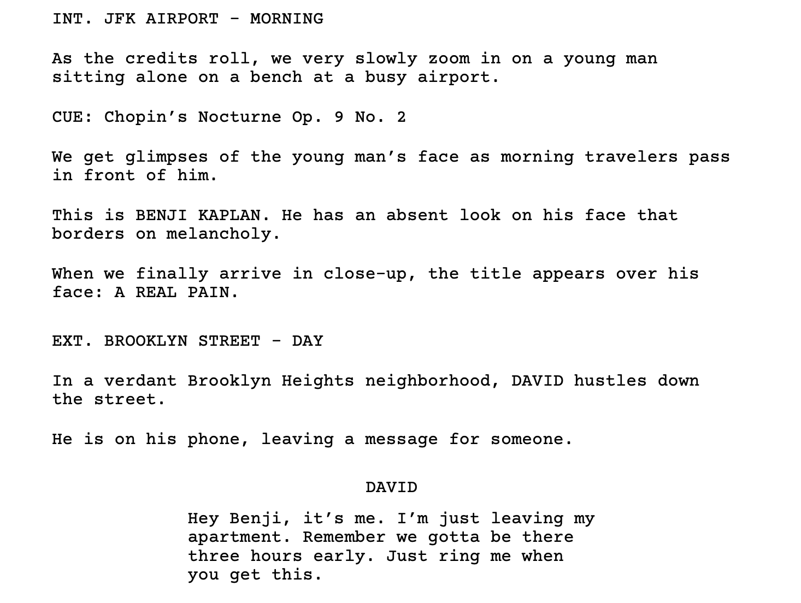

# typstscript



[](https://golang.org/)

A CLI tool for creating Typst screenplay projects.

## Who is this for?

Me. Also anyone that wants to (for whatever dumb reason) write screenplays from neovim.

## Don't want to install some random CLI off the internet?

That's fair. You can find the typst template inside package/, feel free to just copy and paste it yourself. Honestly this is probably the fastest way to get going.

## How does it work?

I embed the template into the binary so that the CLI can place it anywhere you want.

## Installation

### From Source
```bash
git clone git@github.com:ChaseRensberger/typstscript.git
cd typstscript
go build -o typstscript
```

### Binary

You can download the latest binary from the releases section and install/run it however you would like.

## Usage

You will need to have [typst](https://github.com/typst/typst) installed. Then,

Create a new screenplay project:

```bash
./typstscript init my-script
```

This creates a new directory with:
- `my-script.typ` - Main screenplay file with your title
- `template.typ` - Screenplay formatting functions
- `fonts/` - Courier Prime font family

Compile your screenplay:

```bash
cd my-script
typst compile --font-path ./fonts my-script.typ
```

You can then start writing your script inside `my-script.typ`. Syntax looks like:
```
#action[
  He is on his phone, leaving a message for someone.
]

#dialogue_block[
  #character("DAVID")
  #line[Hey Benji, it's me. I'm just leaving my apartment. Remember we gotta be there three hours early. Just ring me when you get this.]
]
```

## Making this easier to use (Snippets)

You'll probably want to add some custom snippets to your editor of choice. These are the snippets I use with LuaSnip in my neovim config:

```lua
local ls = require("luasnip")
local s = ls.snippet
local t = ls.text_node
local i = ls.insert_node

ls.add_snippets("typst", {
	s("a", {
		t("#action["),
		t({ "", "  " }),
		i(0, "action"),
		t({ "", "]" }),
	}),
	s("d", {
		t("#dialogue_block["),
		t({ "", "  " }),
		i(0),
		t({ "", "]" }),
	}),
	s("s", {
		t("#scene(\""),
		i(0, "scene"),
		t({ "\")" }),
	}),
	s("l", {
		t("#line["),
		i(0, "line"),
		t({ "]" }),
	}),
	s("c", {
		t("#character(\""),
		i(0, "character"),
		t({ "\")" }),
	}),
	s("p", {
		t("#parenthetical(\""),
		i(0, "parenthetical"),
		t({ "\")" }),
	}),
	s("start", {
		t("#import \"template.typ\": *"),
		t({ "", "" }),
		t({ "", "" }),
		t("#show: screenplay.with("),
		t({ "", "  title: \"" }),
		i(0, "title"),
		t("\""),
		t({ "", ")" }),
	}),
})
```

## Roadmap

- [x] Scene headings
- [x] Actions
- [x] Dialogue Blocks/Characters/Parentheticals
- [x] Automatic title page generation

## Formatting
- Courier Prime
- US Letter paper format with 1-inch margins

## Contributing

Issues and pull requests are always more than welcome.

